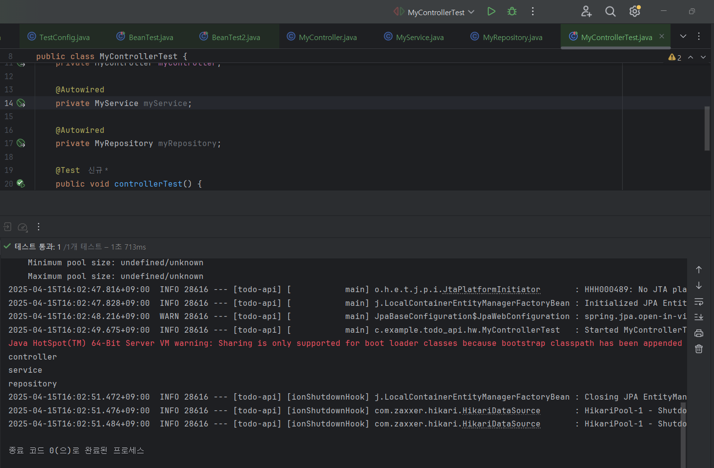

# WEEK2 : 스프링 빈, 컨테이너

# 스프링 빈, 컨테이너

스프링은 객체지향 원칙을 지키면서 개발할 수 있도록 도와준다.

스프링 부트는 스프링을 사용하여 개발할 때 편하게 해주는 도구이다.

### 스프링 어플리케이션의 작동

`GET /todo/list` 요청이 내장 **tomcat 서버**를 통해 스프링 어플리케이션으로 들어오면, 스프링 컨테이너의 **전용 컨트롤러**를 호출해 요청을 처리한다.

이 컨트롤러는 **DB**에서 전체 todolist를 가져오고 **JSON 컨버터**로 Json형식으로 응답해준다.

## 스프링 빈 (Bean)

어플리케이션 전역에서 사용할 스프링이 관리하는 **공용 객체**

**스프링 컨테이너**라고 하는 **공용 창고**에 빈을 저장해두고, 필요한 빈을 컨테이너에서 받아 사용한다.

개발자가 직접 new로 만들어주는 것이 아니라, 스프링이 대신 만들어주고 관리한다.

## 스프링 컨테이너 (Container)

스프링 빈들을 담고 관리하는 큰 박스.

Application Context라고도 한다.

스프링 컨테이너는 애플리케이션이 시작될 때 자동으로 만들어지고, 내가 등록한 모든 빈 객체들을 생성해서 관리해준다.

1. 설정을 읽고 (`@Configuration`, 등)
2. 필요한 빈들을 생성해서
3. 내부에 저장하고 (싱글톤으로 관리)
4. 의존성 주입도 자동으로 해준다.(`@Autowired`)

# 스프링 빈 등록하기

## 스프링 빈 저장하는 2가지 방법

1. 설정 파일 작성 (수동 등록) : `@Configuration` + `@Bean`
2. 컴포넌트 스캔 (자동 등록) : `@Component`, .. 등등

## 1. 설정 파일 기반 컨테이너 빈 만들기

### TestConfig

설정 파일에서 myBean이라는 빈을 등록한다.

어노테이션 컨테이너 → `@Bean` 과 같은 어노테이션을 사용하여 빈을 생성한다.

```java
@Configuration // 설정 파일
public class TestConfig {

    @Bean // 객체가 앞으로 스프링 빈으로 등록된다.
    MyBean myBean() {
        return new MyBean();
    }
}
```

### BeanTest

설정 파일에는 컨테이너에 등록할 빈 정보가 담겨있다.

설정 파일 정보를 이용해서 스프링 컨테이너를 생성하고, 컨테이너 안에 빈이 잘 담겼는지 확인해보자.

`ApplicationContext`로 컨테이너를 생성했다.

TestConfig를 이용해서 테스트 전용 **스프링 컨테이너**를 따로 만들었다.

```java
public class BeanTest {
    // 어노테이션을 기반 설정파일로 스프링 컨테이너를 만들것이다.
    ApplicationContext context = new AnnotationConfigApplicationContext(TestConfig.class);

    @Test 
    public void getAllBeanTest(){
        스프링 컨테이너 안에 있는 모든 빈을 조회하는 테스트
        for(String name:context.getBeanDefinitionNames()){
            System.out.println(name);
        }
    }
}
```

출력되는 스프링 빈

```java
org.springframework.context.annotation.internalConfigurationAnnotationProcessor
org.springframework.context.annotation.internalAutowiredAnnotationProcessor
org.springframework.context.annotation.internalCommonAnnotationProcessor
org.springframework.context.annotation.internalPersistenceAnnotationProcessor
org.springframework.context.event.internalEventListenerProcessor
org.springframework.context.event.internalEventListenerFactory
**testConfig
myBean**
```

위 5개의 빈은 스프링 컨테이너를 만들 때 기본적으로 생성되는 빈이다.

testConfig 라는 설정 파일도 빈으로 설정되고, myBean이 빈으로 설정된다.

→ 스프링 컨테이너 `Application Context` 안에 이러한 빈들이 생성된다.

매번 눈으로 출력 결과를 확인하기는 불편하다.

따라서 Assertions 라이브러리를 이용해서 테스트를 검증할 수 있다.

```java
import org.assertj.core.api.Assertions;

public class BeanTest {
    ApplicationContext context = new AnnotationConfigApplicationContext(TestConfig.class);
    
    @Test 
    public void getAllBeanTest(){
		    // context 안에 myBean이 들어있는지 검증 
        Assertions.assertThat(context.getBeanDefinitionNames()).contains("myBean");
    }
}
```

- `getBeanDefinitionNames()` : 이 컨테이너에 들어있는 모든 빈의 이름들의 리스트가 나온다.
- `contains()` 라는 검증 조건이 참이면 문제 없이 테스트가 통과한다.

## 하나의 객체를 공유한다는 것

스프링에서 기본적으로 빈은 **싱글톤**으로 생성되므로, **각 클래스에 대해 하나의 객체만 생성해서 공유**한다.

다시 말해, 스프링 컨테이너에는 여러 개의 객체(빈)가 들어있으며, 객체는 컨테이너 전체에 하나가 아니라, “각 빈당 하나씩” 있는 것이다.

만약 A가 myBean을 요구했고, B도 myBean을 이후에 요구했다면, 이 두 객체는 완전히 동일한 객체를 가리킨다.

컨테이너에서 원하는 빈을 선택해서,

context에서 객체를 두번 가져왔을 때를 시험해보자.

### BeanTest

```java
@Test
    public void getOneBeanTest(){
        // context에서 하나의 스프링 빈을 스프링 빈 타입으로 가져오자.
        MyBean myBean1 = context.getBean(MyBean.class);
        MyBean myBean2 = context.getBean(MyBean.class);

        // 두 객체가 같은 객체인가?
        System.out.println(myBean1);
        System.out.println(myBean2);
        
        Assertions.assertThat(myBean1).isSameAs(myBean2);
    }
```

출력

```java
com.example.todo_api.bean.MyBean@1583741e
com.example.todo_api.bean.MyBean@1583741e
```

뒷 부분의 객체 고유값이 같은 것을 볼 수 있다.

## 2. 컴포넌트 스캔으로 컨테이너 빈 만들기

빈을 생성할 클래스에 `@Component` 어노테이션을 사용한다. 스프링이 어플리케이션을 시작할 때 `@Component`가 붙은 클래스를 찾아서 자동으로 빈을 등록한다.

### TestConfig

TestConfig 클래스 내부 코드(`@Bean` ~~ )를 모두 지웠음에도,

TestConfig로 어플리케이션 컨텍스트를 만들 때, ComponentScan이 발생하면서 모든 컴포넌트를 스캔하여 `@Component`가 붙은 클래스를 자동으로 빈으로 등록해준다.

```java
@Configuration 
@ComponentScan
public class TestConfig {
	// @Bean
	// ..
}
```

### MyBean

```java
@Component
public class MyBean {}
```

### 그런데 설정 파일 없이도 가능해야 하지 않나?

맞다! 사실 어플리케이션 파일에 `@SpringBootApplication` 어노테이션을 들어가보면,

```java
@Target(ElementType.TYPE)
@Retention(RetentionPolicy.RUNTIME)
@Documented
@Inherited
@SpringBootConfiguration
@EnableAutoConfiguration
@ComponentScan(excludeFilters = { @Filter(type = FilterType.CUSTOM, classes = TypeExcludeFilter.class),
		@Filter(type = FilterType.CUSTOM, classes = AutoConfigurationExcludeFilter.class) })
public @interface SpringBootApplication {
```

`@ComponentScan` 이 들어있는 것을 볼 수 있다.

→ 별도의 설정파일을 만들어주지 않아도 스프링 컨테이너에 빈을 만들어준다.


## 정리

어떤 객체를 스프링 빈으로 등록하려면, 그 객체의 클래스 위에 `@Component`를 작성하면 된다.

# 의존성 주입

빈을 사용할 때는 컨테이너에서 `new`로 직접 빈(객체)을 꺼내지(생성하지) 않고 **프레임워크에게 필요한 빈을 요청**하고 받아서 사용한다.

스프링에서는 컨테이너에 저장된 빈과 빈 사이의 의존성을 프레임워크가 주입하는 것을 말한다.

## 의존성

자동차가 움직이려면 반드시 바퀴가 필요하다.

자동차(Car class)는 바퀴(Wheel class)에 의존한다.

### 의존성을 주입 받는 이유

객체 지향 원칙 중 하나로, OCP원칙을 준수한다.

OCP원칙이란 Open Close Principle 로, 변경에는 닫혀있고 확장에는 열려있다는 뜻이다. 새로운 기능을 추가하고자 할 때, 기존 코드는 많이 건드리지 않고 새로운 기능을 추가할 수 있어야 좋다. → 유지 보수에 용이하다.

한번 생성해둔 객체를 여러 번 재 사용하므로 메모리도 효율적으로 사용할 수 있다.

## 의존성 추가하기

MyBean이 MySubBean에 의존하도록 한다.

### MySubBean

```java
@Component // 빈 등록 
public class MySubBean {
}
```

### MyBean

```java
@Component
@Getter
public class MyBean {
    // 의존성 주입
    private MySubBean mySubBean;
}
```

나중에 테스트를 할 때, MyBean이 가지고 있는 MySubBean 필드에 접근하기 위해서는 `@Getter`가 필요하다.

# 의존성 주입 방법

어떤 객체에 다른 객체를 주입하려면, **주입할 통로**가 필요하다. 우리는 `@Autowired`로 통로 표시를 남기면 프레임워크가 알아서 객체를 주입해준다.

통로는 **생성자, 필드**, 메서드(세터) 3가지가 존재한다.

1. **생성자 주입** : 어플리케이션 코드를 작성할 때 사용
2. 필드 주입 : 테스트 코드를 작성할 때 사용

## 1. 생성자 주입

의존성이 바뀔 일이 없는 경우 안전하게 `final`로 선언한다. `final` 필드는 반드시 생성자를 통해 초기화된다.

### MyBean

```java
@Component
@Getter
public class MyBean {
    // 의존성 주입
    private final MySubBean mySubBean;

    // 생성자
    // mySubBean을 주입할 때는 이 생성자로 주입하도록 한다.
    // @Autowired // 통로 !
    public MyBean(MySubBean mySubBean) {
        this.mySubBean = mySubBean;
    }
}
```

생성자에 `@Autowired`를 사용해 생성자를 통해 빈을 주입할 수 있게 한다.

이때 만약 생성자가 하나라면 `@Autowired`를 생략할 수 있다.

함수 왼쪽에 초록색 화살표는 “여기로 의존성을 주입할 수 있다”는 의미이다.

### 생성자 코드 생략

`@RequiredArgsConstructor` 를 사용하면 모든 `final` 필드에 대한 생성자를 자동으로 만들어주어 생성자 코드를 생략할 수 있다.

```java
@Component
@Getter
@RequiredArgsConstructor
public class MyBean {

    private final MySubBean mySubBean;
    // 생성자 코드 생략 ..
}
```

### 생성자 주입 테스트

MyBean을 통해서 가져온 MySubBean 객체가 MySubBean 객체와 같은 것인가?

```java
@Test
    public void dependencyInjection(){
        MyBean myBean = context.getBean(MyBean.class);
        MySubBean mySubBean = context.getBean(MySubBean.class);

        // 두 객체가 같은 객체인가?
        System.out.println(myBean.getMySubBean());
        System.out.println(mySubBean);

        Assertions.assertThat(myBean.getMySubBean()).isSameAs(mySubBean);
    }
```

출력

```java
com.example.todo_api.bean.MySubBean@29a5f4e7
com.example.todo_api.bean.MySubBean@29a5f4e7
```

같은 객체이다.

## 2. 필드 주입

필드 위에 바로 `@Autowired` 를 쓰는 것이다.

`@Autowired`를 쓸 때에는 `final` 키워드는 쓸 수 없어서 `@RequiredArgsConstructor` 는 쓸 수 없다.

필드 주입은 주로 테스트 코드에서 사용한다!

테스트에서 필드 주입을 하려면, 테스트를 실행할 때 이미 스프링 컨테이너가 존재해야 한다.

`ApplicationContext`로 컨테이너를 만들지 않는다.

→ `@SpringBootTest` : 테스트 실행 전에 스프링 부트를 실행시켜서 어플리케이션에 있는 **모든 빈을 이 컨테이너에 등록한다.**

스프링 부트까지 실행시키므로 통합 테스트에서도 사용할 수 있다.

→ `@Autowired`로 바로 필드를 주입한다.

### BeanTest2

```java
@SpringBootTest
public class BeanTest2 {

    @Autowired
    private MyBean myBean;

    @Autowired
    private MySubBean mySubBean;

    @Test
    public void dependencyInjection(){
        // 두 객체가 같은 객체인가?
        System.out.println(myBean.getMySubBean());
        System.out.println(mySubBean);

        Assertions.assertThat(myBean.getMySubBean()).isSameAs(mySubBean);
    }
}
```

- 결과

    ```java
    14:59:30.363 [main] INFO org.springframework.test.context.support.AnnotationConfigContextLoaderUtils -- Could not detect default configuration classes for test class [com.example.todo_api.bean.BeanTest2]: BeanTest2 does not declare any static, non-private, non-final, nested classes annotated with @Configuration.
    14:59:30.671 [main] INFO org.springframework.boot.test.context.SpringBootTestContextBootstrapper -- Found @SpringBootConfiguration com.example.todo_api.TodoApiApplication for test class com.example.todo_api.bean.BeanTest2
    
      .   ____          _            __ _ _
     /\\ / ___'_ __ _ _(_)_ __  __ _ \ \ \ \
    ( ( )\___ | '_ | '_| | '_ \/ _` | \ \ \ \
     \\/  ___)| |_)| | | | | || (_| |  ) ) ) )
      '  |____| .__|_| |_|_| |_\__, | / / / /
     =========|_|==============|___/=/_/_/_/
    
     :: Spring Boot ::                (v3.4.4)
    
    2025-04-15T14:59:32.038+09:00  INFO 35008 --- [todo-api] [           main] com.example.todo_api.bean.BeanTest2      : Starting BeanTest2 using Java 17.0.14 with PID 35008 (started by PC in C:\25-1_GDG_Backend\todo-api\todo-api)
    2025-04-15T14:59:32.041+09:00  INFO 35008 --- [todo-api] [           main] com.example.todo_api.bean.BeanTest2      : No active profile set, falling back to 1 default profile: "default"
    2025-04-15T14:59:33.643+09:00  INFO 35008 --- [todo-api] [           main] .s.d.r.c.RepositoryConfigurationDelegate : Bootstrapping Spring Data JPA repositories in DEFAULT mode.
    2025-04-15T14:59:33.708+09:00  INFO 35008 --- [todo-api] [           main] .s.d.r.c.RepositoryConfigurationDelegate : Finished Spring Data repository scanning in 40 ms. Found 0 JPA repository interfaces.
    2025-04-15T14:59:34.916+09:00  INFO 35008 --- [todo-api] [           main] com.zaxxer.hikari.HikariDataSource       : HikariPool-1 - Starting...
    2025-04-15T14:59:35.340+09:00  INFO 35008 --- [todo-api] [           main] com.zaxxer.hikari.pool.HikariPool        : HikariPool-1 - Added connection conn0: url=jdbc:h2:mem:c022715a-7dd8-4195-bc5e-fc773879a8fe user=SA
    2025-04-15T14:59:35.343+09:00  INFO 35008 --- [todo-api] [           main] com.zaxxer.hikari.HikariDataSource       : HikariPool-1 - Start completed.
    2025-04-15T14:59:35.479+09:00  INFO 35008 --- [todo-api] [           main] o.hibernate.jpa.internal.util.LogHelper  : HHH000204: Processing PersistenceUnitInfo [name: default]
    2025-04-15T14:59:35.630+09:00  INFO 35008 --- [todo-api] [           main] org.hibernate.Version                    : HHH000412: Hibernate ORM core version 6.6.11.Final
    2025-04-15T14:59:35.717+09:00  INFO 35008 --- [todo-api] [           main] o.h.c.internal.RegionFactoryInitiator    : HHH000026: Second-level cache disabled
    2025-04-15T14:59:36.520+09:00  INFO 35008 --- [todo-api] [           main] o.s.o.j.p.SpringPersistenceUnitInfo      : No LoadTimeWeaver setup: ignoring JPA class transformer
    2025-04-15T14:59:36.763+09:00  INFO 35008 --- [todo-api] [           main] org.hibernate.orm.connections.pooling    : HHH10001005: Database info:
    	Database JDBC URL [Connecting through datasource 'HikariDataSource (HikariPool-1)']
    	Database driver: undefined/unknown
    	Database version: 2.3.232
    	Autocommit mode: undefined/unknown
    	Isolation level: undefined/unknown
    	Minimum pool size: undefined/unknown
    	Maximum pool size: undefined/unknown
    2025-04-15T14:59:37.571+09:00  INFO 35008 --- [todo-api] [           main] o.h.e.t.j.p.i.JtaPlatformInitiator       : HHH000489: No JTA platform available (set 'hibernate.transaction.jta.platform' to enable JTA platform integration)
    2025-04-15T14:59:37.589+09:00  INFO 35008 --- [todo-api] [           main] j.LocalContainerEntityManagerFactoryBean : Initialized JPA EntityManagerFactory for persistence unit 'default'
    2025-04-15T14:59:37.930+09:00  WARN 35008 --- [todo-api] [           main] JpaBaseConfiguration$JpaWebConfiguration : spring.jpa.open-in-view is enabled by default. Therefore, database queries may be performed during view rendering. Explicitly configure spring.jpa.open-in-view to disable this warning
    2025-04-15T14:59:39.062+09:00  INFO 35008 --- [todo-api] [           main] com.example.todo_api.bean.BeanTest2      : Started BeanTest2 in 7.857 seconds (process running for 10.47)
    Java HotSpot(TM) 64-Bit Server VM warning: Sharing is only supported for boot loader classes because bootstrap classpath has been appended
    com.example.todo_api.bean.MySubBean@73dbe25
    com.example.todo_api.bean.MySubBean@73dbe25
    2025-04-15T14:59:40.860+09:00  INFO 35008 --- [todo-api] [ionShutdownHook] j.LocalContainerEntityManagerFactoryBean : Closing JPA EntityManagerFactory for persistence unit 'default'
    2025-04-15T14:59:40.863+09:00  INFO 35008 --- [todo-api] [ionShutdownHook] com.zaxxer.hikari.HikariDataSource       : HikariPool-1 - Shutdown initiated...
    2025-04-15T14:59:40.883+09:00  INFO 35008 --- [todo-api] [ionShutdownHook] com.zaxxer.hikari.HikariDataSource       : HikariPool-1 - Shutdown completed.
    ```


# 스프링 계층 구조

## 계층을 분리하는 이유?

- 계층 별로 코드를 변경할 때 다른 계층에 미치는 영향을 최소화하여 확장에 용이하다
- 계층에 따른 테스트를 진행할 수 있어, 단위 테스트 및 통합 테스트 작성이 쉬워진다.

## 스프링 계층 구조

### 1. Controller

`@Controller` `@RestController`

- 사용자 요청을 받아서 응답 데이터를 반환한다.
- 클라이언트와 서버 간의 인터페이스 역할을 담당하며 HTTP 요청 및 응답을 처리한다.
- 요청을 Service에 전달하고, 요청된 결과를 클라이언트에게 반환한다.

### 2. Service

`@Service`

- 핵심 비지니스 로직을 처리하는 계층
- 여러 Repository를 조합해서 로직을 구현한다.

### 3. Repository

`@Repository`

- 실제 DB와 상호작용하여 데이터를 저장하거나 조회한다.
- CRUD, 쿼리 수행 등의 역할을 맡는다.

### 4. Domain / Entity

`@Entity`

실제 데이터를 표현하는 도메인 모델, 엔티티 클래스들

- DB 테이블과 매핑된다.

## 스프링 빈 활용

**컨트롤러는 서비스에, 서비스는 레포지토리에 의존한다.**

예시 - myController

```java
@Getter
@Component
@RequiredArgsConstructor
public class MyController {
    private final MyService myService;

    public void controllerMethod() {
        System.out.println("controller");
        myService.ServiceMethod();
    }
}
```

**컨트롤러, 서비스, 레포지토리**는 스프링 빈으로 등록한다. 그 이유는 매번 새로운 객체를 생성할 필요 없이 의존성을 준수할 수 있기 때문이다.

# 정리

- 스프링 빈 : 공동으로 사용할 하나의 객체
- 스프링 컨테이너 : 빈을 저장하는 공용 공간
- 의존성 주입 : 필요한 빈을 프레임워크가 주입해주는 것

- 컨테이너에 빈을 **저장하는** 방법
    - 설정 파일
    - 컴포넌트 스캔
- 컨테이너에서 빈을 **주입받는** 방법
    - 생성자 주입
    - 필드 주입

# 과제 실행 결과 
